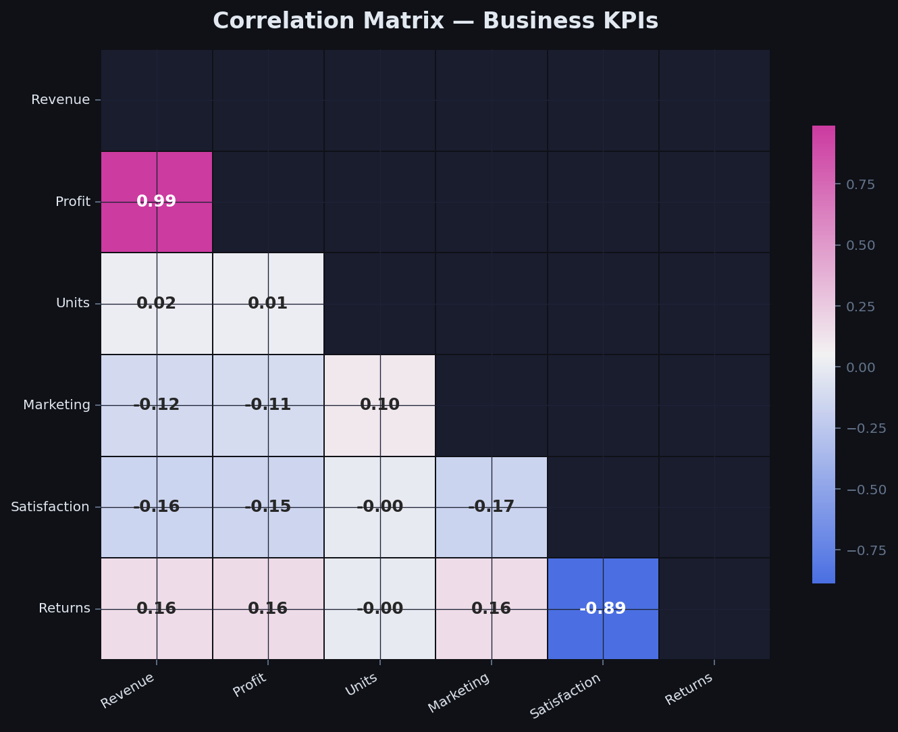
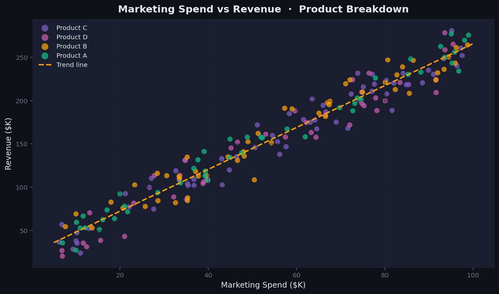
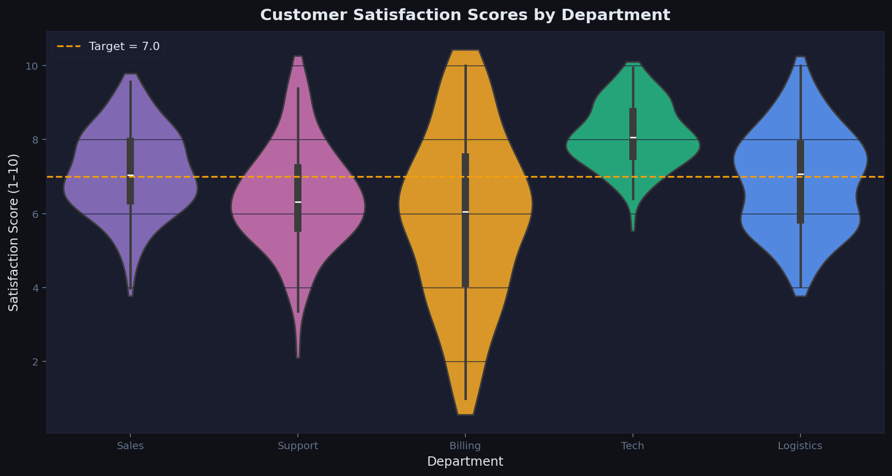
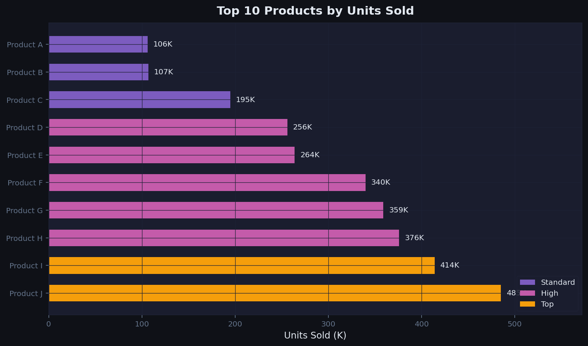
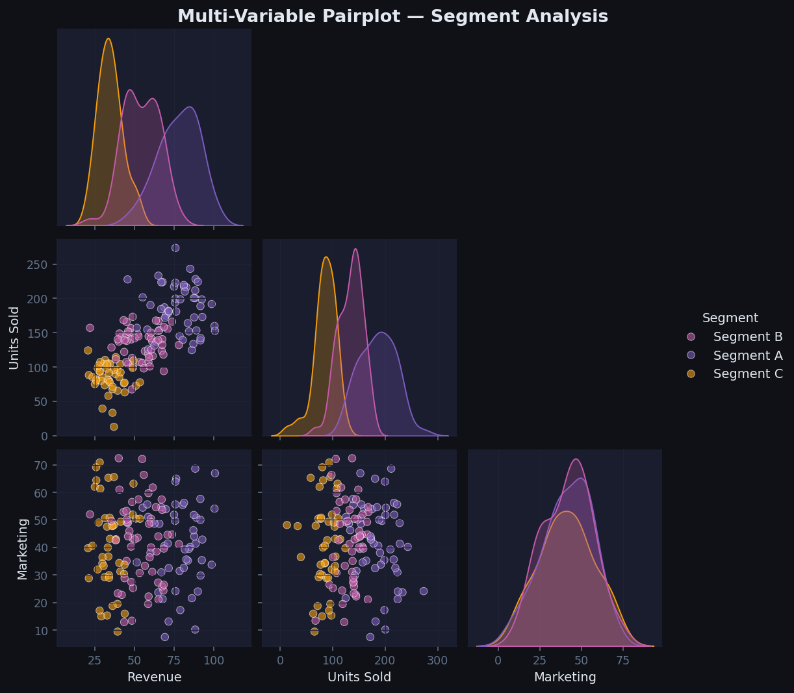

# 📊 Data Visualization Portfolio — Task 3

> **CodeAlpha Internship — Data Science Track**
> Transforming raw data into compelling visual stories using Python's leading visualization libraries.

---

## 🎯 Overview

This project demonstrates end-to-end **Data Visualization** skills, covering everything from raw data generation and cleaning through to insight-rich, publication-quality charts and an interactive dashboard. Each visualization is purposefully designed to support real business decision-making.

---

## 🛠️ Tools & Libraries

| Library | Version | Purpose |
|---------|---------|---------|
| **Matplotlib** | 3.x | Core charting engine, KPI cards, layout |
| **Seaborn** | 0.13.x | Statistical plots (heatmap, violin, pairplot) |
| **Pandas** | 2.x | Data wrangling and DataFrame management |
| **NumPy** | 1.x | Numerical computation, synthetic data |

---

## 📁 Project Structure

```
codealpha_Data-Visualization/
│
├── visualizations.py          # Main script — runs all 6 charts
│
├── assets/                    # Output charts (PNG, 160 dpi)
│   ├── 01_sales_dashboard.png
│   ├── 02_heatmap_correlation.png
│   ├── 03_scatter_marketing.png
│   ├── 04_violin_satisfaction.png
│   ├── 05_hbar_products.png
│   └── 06_pairplot_segments.png
│
└── README.md
```

---

## 📈 Visualizations

### 1. 📊 Global Sales Dashboard
**File:** `assets/01_sales_dashboard.png`

A multi-panel dashboard combining **KPI summary cards**, **line charts**, a **donut chart**, a **stacked bar chart**, and a **sparkline** into one cohesive view.

- Monthly Revenue vs Profit trend lines
- Revenue breakdown by geographic region (donut)
- Stacked bar showing Profit + Expenses composition
- Monthly unit sales trajectory


---

### 2. 🌡️ Correlation Heatmap
**File:** `assets/02_heatmap_correlation.png`

Lower-triangle **correlation matrix** across 6 business KPIs (Revenue, Profit, Units, Marketing Spend, Customer Satisfaction, Returns). Built with Seaborn's diverging palette to immediately highlight positive and negative relationships.



---

### 3. 🔵 Scatter Plot — Marketing Spend vs Revenue
**File:** `assets/03_scatter_marketing.png`

Scatter plot coloured by **product category** with an overlaid **polynomial trend line** revealing the ROI relationship between marketing investment and revenue. Ideal for budget allocation decisions.



---

### 4. 🎻 Violin Plot — Customer Satisfaction
**File:** `assets/04_violin_satisfaction.png`

Violin + box plot comparing **customer satisfaction score distributions** across 5 departments. A dashed target line at 7.0 instantly flags underperforming teams.



---

### 5. 📏 Horizontal Bar Chart — Top 10 Products
**File:** `assets/05_hbar_products.png`

Ranked horizontal bar chart of the **top 10 products by units sold**, colour-coded into Standard / High / Top tiers for rapid performance triage.



---

### 6. 🔀 Pairplot — Multi-Variable Segment Analysis
**File:** `assets/06_pairplot_segments.png`

Corner pairplot across Revenue, Units Sold, and Marketing Spend, **coloured by customer segment**, with KDE density curves on the diagonal. Surfaces cross-variable patterns that single charts miss.



---

## 🚀 How to Run

```bash
# 1. Clone the repository
git clone https://github.com/tanishkakes02-cpu/codealpha_Data-Visualization.git
cd codealpha_Data-Visualization

# 2. Install dependencies
pip install matplotlib seaborn pandas numpy

# 3. Run the script — all 6 charts are saved to assets/
python visualizations.py
```

---

## 💡 Key Design Decisions

| Decision | Rationale |
|----------|-----------|
| **Dark theme** (#0F1117 background) | Reduces eye strain; makes accent colours pop for presentations |
| **Consistent palette** (purple → pink → amber → green) | Semantic colour assignment aids cross-chart recognition |
| **KPI cards on dashboard** | Executives need the headline number before drilling into trends |
| **Violin over plain box** | Shows full distribution shape, not just quartiles |
| **Lower-triangle heatmap** | Eliminates redundant mirror half; cleaner reading |
| **160 dpi PNG output** | Crisp at both screen and print sizes |

---

## 📸 Live Demo Screenshot

> All charts generated and rendered at 160 dpi. See the `assets/` folder for full-resolution outputs.


---

## 👤 Author

**Tanishka** — CodeAlpha Data Science Intern
- GitHub: [@tanishkakes02-cpu](https://github.com/tanishkakes02-cpu)
- Task: #3 — Data Visualization

---

## 📜 License

This project is part of the CodeAlpha internship programme. Free to use for educational purposes.
